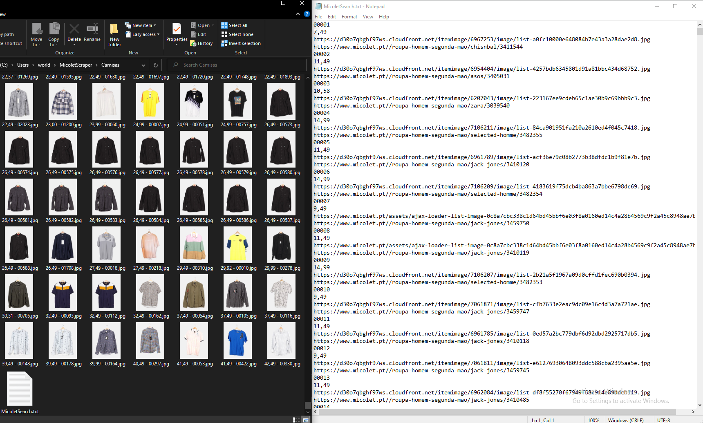

# Micolet Scraper

## Usage

Set the search url, run the script. It will download the images of the items and you can sort them by name in the file explorer. Because of the naming convention while downloading the images, this is the same as sorting them by price.


If you find something you like, you can copy the ID and search for it in the ``` MicoletSearch.txt file. ```

## Input

Search URL. Example:

```
https://www.micolet.pt/roupa-homem-segunda-mao?condition=new&page={i}&size=l&subcategories=3
```

where {i} will be the page number.

## Output

Images of the items will be downloaded to the directory of ```micolet.py```. Filename will be 

```PRICE - ID.jpg```

A file called ```MicoletSearch.txt``` will be created in the directory of ```micolet.py``` and every item will have its data stored in this format:

```
ID
PRICE 
IMAGE URL
ITEM URL
```



